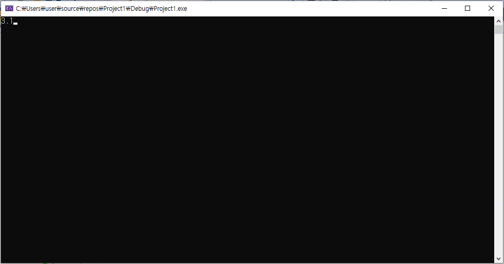

# c언어 코드

```
#include <stdio.h>

int main()
{
	double pi = 0, temp = 1, p = -1, num = 1;
	int a=3, b=10, c=0;
	printf("3.");

	while (num < 1000000000) {
		p *= -1;                      //라이프니츠의 공식
		pi += p * 1.0 / temp;         //이용하여 
		temp += 2;                    //pi값 구하기
		num++;
		if (num == 999999999) {                //999999999번의 계산을 할 때마다 1자리수 씩 출력
			num = 1;                           
			c = (4 * pi * b - a * 10) / 1;     //다음 소수점의 숫자를 구하기 식. ex)3.14 에서 1을 가져오기 위해 31 - 30 
			a = (4 * pi * b) / 1;
			b *= 10;
			printf("%d", c);
		}
	}
}
```


# 결과화면


프로그램 실행 후 소수점 첫자리부터 계산하여 출력




시간 경과 후 


c언어의 소수계산의 한계인지 3.14159265 이후에는 이상한 값이 출력됨.